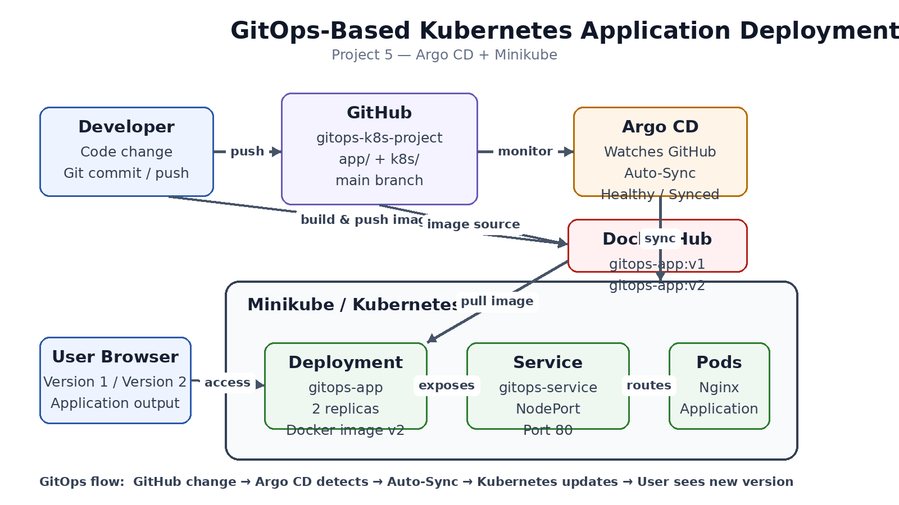

# GitOps-Based Kubernetes Application Deployment using ArgoCD

## 1. Project Title

GitOps-Based Kubernetes Application Deployment using ArgoCD

## 2. Project Overview

This project implements a GitOps-based Kubernetes deployment workflow using Docker, Kubernetes, GitHub, and Argo CD.

__The main idea of GitOps is:__

`Git is the source of truth for Kubernetes application deployments.`

Instead of manually changing the application in the Kubernetes cluster using kubectl, application changes are made in the Git repository. Argo CD monitors the Git repository and automatically synchronizes the Kubernetes cluster with the desired state stored in Git.


## 3. Scenario

The company is migrating its application to Kubernetes and wants all deployments to follow GitOps principles.

__The required rule is:__

### "No manual kubectl changes in production. All deployments must happen via Git repository updates."

Therefore, the GitHub repository contains the Kubernetes manifests, and Argo CD continuously compares the Git state with the Kubernetes cluster.

## 4. Objective

__The objectives of this project are:__

* Containerize a web application using Docker.

* Build and publish Docker images.

* Deploy the application on Kubernetes.

* Store Kubernetes manifests in GitHub.

* Install and configure Argo CD.

* Enable automatic synchronization.

* Demonstrate Git-based application deployment.

* Verify automatic deployment after changing the application from Version 1 to Version 2.

## 5. Architecture



## 6. Technologies Used

* AWS EC2

* Docker

* Docker Hub


* Kubernetes

* Minikube

* kubectl

* Argo CD

* Git

* GitHub


## 7. AWS Infrastructure

### __EC2 Instance__

The project was implemented on an AWS EC2 instance.

__Instance configuration__

* Instance Type: `t3.small`

* Operating System: `Ubuntu`

* Root EBS: `20 GB gp3`

* Additional EBS: `15 GB`

* __Total storage used: approximately `35 GB`__

* Purpose: Host Docker, Minikube, Kubernetes and Argo CD

__The additional EBS volume was mounted__


# 8. Step
## Step 1 - Connect to EC2

From the local Windows machine, connect to the EC2 instance using SSH


## Step 2 - Install Docker
`sudo apt update`

__Install & Enable & status Docker:__
```
sudo apt install docker.io -y
sudo systemctl enable docker
sudo systemctl start docker
sudo systemctl status docker
docker --version
```
__Allow the Ubuntu user to run Docker without sudo:__
```
sudo usermod -aG docker $USER
```

## Step 3 - Install kubectl

__Download the current stable kubectl binary:__
```
curl -LO "https://dl.k8s.io/release/$(curl -L -s https://dl.k8s.io/release/stable.txt)/bin/linux/amd64/kubectl"
```
__Install it:__
```
sudo install -o root -g root -m 0755 kubectl /usr/local/bin/kubectl
```
__Remove the downloaded file:__
```
rm kubectl
```
__Verify:__
```
kubectl version --client
```
## Step 4 - Install Minikube

__Download Minikube:__
```
curl -LO https://storage.googleapis.com/minikube/releases/latest/minikube-linux-amd64
```
__Install it:__
```
sudo install minikube-linux-amd64 /usr/local/bin/minikube
```
__Remove the downloaded file:__
```
rm minikube-linux-amd64
```
__Verify:__
```
minikube version
```
## Step 5 - Start Kubernetes Cluster

Docker was used as the Minikube driver.

The first attempt with 1500 MB memory was not sufficient because Minikube required more memory.

__The working configuration was:__
```
minikube start --driver=docker --cpus=2 --memory=1800mb
```
__Check Minikube:__

`minikube status`

__Expected result:__
```
host: Running
kubelet: Running
apiserver: Running
kubeconfig: Configured
```
__Check the Kubernetes node:__
```
kubectl get nodes
```

## 15. Step 6 - Create Project Directory

__Create the project structure:__
```
mkdir -p ~/gitops-k8s-project/app
mkdir -p ~/gitops-k8s-project/k8s
cd ~/gitops-k8s-project
```
__Project structure:__
```
gitops-k8s-project/
├── app/
│   ├── Dockerfile
│   └── index.html
└── k8s/
    ├── deployment.yaml
    └── service.yaml
```
## Step 7 - Create Application

__Create:_-
```
app/index.html
```
__Version 1:__
```
<!DOCTYPE html>
<html>
<head>
    <title>GitOps Project</title>
</head>
<body>
    <h1>Hello from Version 1</h1>
    <p>GitOps Kubernetes Deployment</p>
</body>
</html>
```
## Step 8 - Create Dockerfile

__Create:__
```
app/Dockerfile
```
__Content:__
```
FROM nginx:latest

COPY index.html /usr/share/nginx/html/index.html

EXPOSE 80
```

## Step 9 - Build Docker Image

__Move to the application directory:__
```
cd ~/gitops-k8s-project/app
```
__Build Version 1:__
```
docker build -t iamadeshkhandale/gitops-app:v1 .
```
__Check the image:__
```
docker images
```
##  Step 10 - Push Docker Image to Docker Hub

__Login to Docker Hub:__
```
docker login
```
__Push Version 1:__
```
docker push iamadeshkhandale/gitops-app:v1
```
__Verify the image in the Docker Hub repository:__
```
iamadeshkhandale/gitops-app
```


## Step 11 - Create Kubernetes Deployment

__Create:__
```
k8s/deployment.yaml
```
Content:
```
apiVersion: apps/v1
kind: Deployment
metadata:
  name: gitops-app
spec:
  replicas: 2
  selector:
    matchLabels:
      app: gitops-app
  template:
    metadata:
      labels:
        app: gitops-app
    spec:
      containers:
        - name: gitops-app
          image: iamadeshkhandale/gitops-app:v1
          ports:
            - containerPort: 80
```
## Step 12 - Create Kubernetes Service

Create:
```
k8s/service.yaml
```
Content:
```
apiVersion: v1
kind: Service
metadata:
  name: gitops-service
spec:
  selector:
    app: gitops-app
  ports:
    - protocol: TCP
      port: 80
      targetPort: 80
  type: NodePort
```
The Service provides network access to the application pods.


## Step 13 - Connect GitHub Repository

__GitHub repository used for this project:__

`adeshkhandale171/gitops-k8s-project`

__Add the GitHub remote:__
```
git remote add origin <YOUR-GITHUB-REPOSITORY-URL>
```
Verify:

`git remote -v`

## 24. Step 14 - Initialize, Commit and Push Project
```
git init
git add .
git commit -m "Initial GitOps project"
git push -u origin main
```

The GitHub repository acts as the source of truth for the Kubernetes manifests.

## Step 15 - Install Argo CD

__Create the Argo CD namespace:__
```
kubectl create namespace argocd
```
__Install Argo CD:__
```
kubectl apply -n argocd -f https://raw.githubusercontent.com/argoproj/argo-cd/stable/manifests/install.yaml
```

## Step 16 - Verify Argo CD

__Run:__
```
kubectl get pods -n argocd
```
__Important Argo CD components include:__

`argocd-application-controller`

`argocd-applicationset-controller`

`argocd-dex-server`

`argocd-notifications-controller`

`argocd-redis`

`argocd-repo-server`

`argocd-server`

All required components should become `Running`.

## Step 17 - Get Argo CD Initial Password

__Run:__
```
kubectl -n argocd get secret argocd-initial-admin-secret -o jsonpath="{.data.password}" | base64 -d; echo
```
__Username:__
```
admin
```
Use the generated password only for the initial login and change it for a real environment.

## Step 18 - Access Argo CD UI

Argo CD is not directly exposed to the Internet in this project.

__On the EC2 instance run:__
```
kubectl port-forward svc/argocd-server -n argocd 8080:443
```
Keep this terminal running.

__From the Windows/local machine, create an SSH tunnel:__
```
ssh -i "your-key.pem" -L 8080:localhost:8080 ubuntu@<EC2-PUBLIC-IP>
```
__Open in the browser:__
```
https://localhost:8080
```
The browser may show a certificate warning because the default Argo CD installation uses a self-signed certificate. This is expected for this lab setup. 

##  Step 19 - Create Argo CD Application

Log in to the Argo CD web UI.

Create a new application with the following configuration.

__General__
```
Application Name: gitops-k8s-app
Project: default
Sync Policy: Automatic
```
## Automatic Sync

__Enable:__
```
Auto-Sync: ON
Prune Resources: ON
Self Heal: ON
```
## Source
```
Repository:
GitHub repository
```
__Revision:__
```
main
```

__Path:__
```
k8s
```
## Destination

__Cluster:__
```
in-cluster
```
__Namespace:__
```
default
```
__The destination for an application deployed into the same cluster as Argo CD is the Kubernetes API server:__

https://kubernetes.default.svc

__Click:__
```
CREATE
```
##  Step 20 - Verify Argo CD Application

__The application should show:__
```
Application: gitops-k8s-app
Health: Healthy
Sync Status: Synced
```


Argo CD reads the Kubernetes manifests from the Git repository and synchronizes them to the Kubernetes cluster.


## Step 21 - Verify Kubernetes Deployment

__Run:__
```
kubectl get pods
```
__Expected result:__

gitops-app-xxxxxxxxxx-xxxxx   1/1   Running
gitops-app-xxxxxxxxxx-xxxxx   1/1   Running

__Check Deployment:__
```
kubectl get deployment
```
__Expected:__
```
NAME         READY   UP-TO-DATE   AVAILABLE
gitops-app   2/2     2            2
```
__Check Service:__
```
kubectl get service
```

## Step 22 - Access Version 1 Application

Because the Kubernetes cluster is running inside the EC2 instance, the application was accessed through port forwarding instead of exposing the NodePort directly to the Internet.

__On EC2:__
```
kubectl port-forward svc/gitops-service 8081:80
```
__From Windows/local machine:__
```
ssh -i "your-key.pem" -L 8081:localhost:8081 ubuntu@<EC2-PUBLIC-IP>
```
# Open:

http://localhost:8081


##  Step 23 - GitOps Version 2 Update

This is the main GitOps demonstration.

__Change:__
```
app/index.html
```
__from Version 1 to Version 2:__
```
<!DOCTYPE html>
<html>
<head>
    <title>GitOps Project</title>
</head>
<body>
    <h1>Hello from Version 2</h1>
    <p>GitOps Kubernetes Deployment</p>
</body>
</html>
```
## Step 24 - Build Docker Version 2

__Run:__
```
cd ~/gitops-k8s-project/app
```
__Build:__
```
docker build -t iamadeshkhandale/gitops-app:v2 .
```
__Push:__
```
docker push iamadeshkhandale/gitops-app:v2
```
## Step 25 - Update Kubernetes Manifest

__Edit:__
```
k8s/deployment.yaml
```
__Change the image:__
```
image: iamadeshkhandale/gitops-app:v1
```
__to:__
```
image: iamadeshkhandale/gitops-app:v2
```
This change is important because Git must contain the desired Kubernetes state.

## Step 26 - Commit and Push Version 2

__Go to the project directory:__
```
cd ~/gitops-k8s-project
```
```
git status
git add .
git commit -m "Update application to version 2"
git push
```
## Step 27 - Do NOT Run kubectl Apply

__For the GitOps demonstration, do not run:__
```
kubectl apply -f k8s/
```
The purpose of this project is to demonstrate that the deployment is controlled by Git.


## Step 28 - Verify Automatic Deployment

__Open Argo CD:__
```
gitops-k8s-app
```
__Verify:__
```
Health: Healthy
Sync Status: Synced
Target Revision: main
Path: k8s
```


__Then check Kubernetes:__
```
kubectl get pods
```
The pods should be recreated/updated with the Version 2 image.

__Check the image:__
```
kubectl get deployment gitops-app -o jsonpath='{.spec.template.spec.containers[0].image}'
```
__Expected:__
```
iamadeshkhandale/gitops-app:v2
```
## Step 32 - Verify Version 2 in Browser

__Use the same port-forward:___
```
kubectl port-forward svc/gitops-service 8081:80
```
__Open:__

http://localhost:8081


This proves that the application was updated through Git and automatically synchronized by Argo CD.


# Security Notes

* Do not store GitHub Personal Access Tokens in GitHub.

* Do not store passwords in YAML files.

* Do not commit AWS access keys.

* Do not commit private SSH keys.

* Use GitHub Secrets or another secret-management solution for real CI/CD systems.

* Argo CD should be exposed securely in production using proper TLS and authentication.

* The port-forward method was used in this project to avoid unnecessarily exposing Argo CD and the application to the Internet.

# Github URL
https://github.com/adeshkhandale171/gitops-k8s-project.git
# Conclusion

This project demonstrates how GitOps can be used to manage Kubernetes application deployments.

GitHub acts as the source of truth, while Argo CD continuously monitors the repository and synchronizes the Kubernetes cluster. Docker is used to package the application, Docker Hub stores the container images, and Minikube provides the Kubernetes environment.

The Version 1 to Version 2 deployment test proves that an application can be updated by changing the Git repository instead of manually applying Kubernetes manifests with kubectl.

This provides a simple practical demonstration of declarative Kubernetes deployment and GitOps-based continuous delivery.

